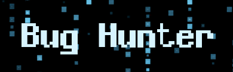
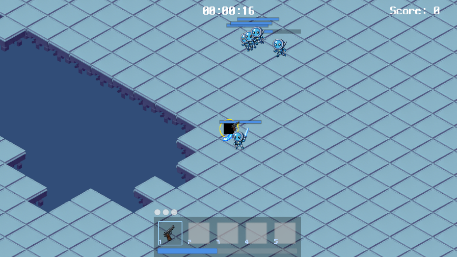

# Bug Hunter

- 장르: 2D 쿼터뷰 탄막 슈팅 게임
- 설명: 5분 간 버그와 바이러스들의 공격을 피해 살아남고, 다양한 디버깅 무기들로 컴퓨터를 지켜라!

### 게임 조작법
- 이동 및 대시: WASD, Space Bar
- 조준 및 공격: 마우스 커서 방향 조준 후 마우스 좌클릭 발사
- 무기 교체: 숫자 패드 1, 2, 3, 4, 5
- 게임 시작: 마우스 좌클릭으로 게임 진입 이후 E
- 일시 정지: ESC

### 설치 방법
- GitHub 내 Releases의 최신 빌드 파일 다운로드
    - 최신 버전 : BugHunter_v2.0

### 저자
- Cleanhea: 몬스터 구현 담당
- sucheoli: 플레이어 · 맵 구현 담당
- mandw0103: 무기 시스템 구현 담당
- SuminOk1205: UI · 오디오 구현 담당

### 소프트웨어 및 하드웨어 요구사항
- Windows 11/10
- 키보드/마우스 입력 지원 PC

### 인게임

## 프로젝트 개요
### 기술 스택 & 환경
- **엔진 / 언어**: Unity 6000.4.5f1 / C#
- **버전 관리**: Git, Git Flow 방식 사용
- **커뮤니케이션**: *Discord / Notion / 카카오톡*

### Git Flow 방식 설명
- 총 5개의 branch로 구성됩니다.

### main
- main 브랜치에 코드를 작성/수정하는 일은 절대로 없도록 합니다.
- 오로지 release, hotfix 브랜치만 병합시킵니다.
- 배포 가능한 상태의 최종 결과물만을 안전하게 관리하는 공간으로 활용합니다.

### develop
- develop 브랜치에 코드를 직접 작성/수정하는 일은 없도록 합니다.
- 베이스 캠프로써 Feature 브랜치를 병합시킵니다.
- 전체적인 시스템 통합 테스트를 진행하는 중심 축입니다.

### release
- main branch 들어가기 전에 최종 작업본을 올립니다.
- main 브랜치에 최종 통합하여 출시하기 전 단계에서 시스템의 마지막 안정성을 검증하고 배포본 빌드 및 README 파일 보완 작업을 수행하는 용도로 분리해 사용합니다.

### feature
- 메인 기능을 작성하는 공간입니다.
- 기능별로 브랜치를 생성해 작업합니다.

### hotfix
- 최종 결과물 빌드를 출력한 이후 실구동 및 디버깅 과정에서 긴급하게 발견된 예외 상황과 버그 요소를 신속하게 수정하여 반영하기 위해 사용합니다.

## 유니티 협업 개발 원칙
- 다른사람이 만든 코드를 직접 수정하는건 지양하고, 만약 그럴일이 생긴다면 연락 및 PR로 허락을 구해야합니다.
- 다른사람이 작업하던 씬은 절대로 건들지 않도록 합시다. (다른사람이 만든 씬을 테스트 할 일이 있다면 해당 씬을 복사, 붙여넣기하여 수정하도록 합니다.)
- 추후 충돌이 발생할 경우 따로 연락을 드리도록 하겠습니다.
- 되도록이면 제작된 모든 작업물들은 prefab화 시켜서 저장합니다.
- _Sandbox는 테스트 진행 용도의 디렉토리입니다.
- _Project는 완성된 본인의 작업물을 올리는 디렉토리입니다.

## 주요 기능 (Features)
- 플레이어 및 맵: WASD 이동, 대시 기믹 및 피격 판정, 알고리즘 기반의 맵 자동 생성 시스템
- 무기: 마우스 조준 및 발사 메커니즘, 광역/차지 특수 무기
- 몬스터: 몬스터 실시간 스폰 로직, 피격 판정
- UI 및 오디오: 게임 전반 UI, AudioMixer 연동 볼륨